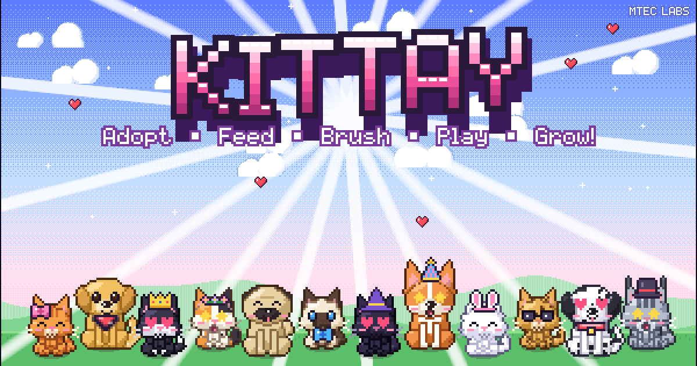

# Kittay

**An 8-bit virtual pet game from MTEC Labs.** It runs in the browser and is built for the iPad. Adopt a kitten or a puppy, take care of it, and watch it grow up.



## What's in the game

- **Opening:** a tap-to-start screen (needed so the iPad will play sound), the animated **MTEC Labs** intro, the title screen, and the main menu.
- **8 kittens that grow into cats:** Ginger Tabby, Tuxedo, Calico, Siamese, Midnight (black cat), Snowball (fluffy Persian with one blue eye and one gold eye), Bengal and Maine Coon.
- **4 puppies that grow into dogs:** Golden Pup, Pug, Corgi and Dalmatian. Puppies unlock at Star Level 3.
- **3 growth stages:** Kitten → Young Cat (level 5) → Cat (level 10). Puppies go through the same stages. Each growth step plays a short cutscene.
- **Care actions:**
  - **Feed:** 12 foods, and each breed has a favorite.
  - **Pet:** rub the pet with your finger.
  - **Play:** three mini-games.
  - **Train:** trick school that teaches 8 tricks.
  - **Brush:** brush out tangles.
  - **Groom:** a bubble bath (scrub, rinse, then towel dry).
  - **Bedtime:** turn off the light so the pet can nap.
  - **Cleaning:** tap any messes on the floor to clean them up.
- **Mini-games:**
  - **Treat Catch:** catch falling treats and dodge the water drops.
  - **Mouse Pop:** tap the mice, but not the cucumbers.
  - **Kitty Run / Puppy Run:** a side-scrolling runner with a double jump.
- **Levels:** pets earn XP and level up. Players also have a **Star Level**, which unlocks new food, outfits, room items, games and puppies.
- **Pet Shop:** food, 20 outfit items (hats, collars, glasses), and room decor: 6 wallpapers, 5 floors and 12 pieces of furniture, such as a fish tank, fairy lights, a cat tree and a disco ball. Puppies and extra kittens are adopted here too.
- **Quests:** 3 daily quests plus a daily bonus, and 20 longer "Adventures" (achievements).
- **Daily gift** with a login streak.
- **Up to 6 pets per player** and **3 player slots**, so each child can have their own game on a shared iPad.
- **Chiptune music and sound effects** are all generated in code (meows, barks, purring and more).
- **Saving:** the game saves automatically to **cookies**, with a backup copy in the browser's local storage. A **Backup Save** code lets you copy the pets to another device.

Everything is in one file, `index.html`. It doesn't load any images, fonts or libraries from the internet; all the art is drawn in code.

## Putting it on Bluehost

1. Log in to Bluehost and open **Hosting → File Manager** (on some accounts it's under *Advanced → cPanel → File Manager*).
2. Open the **`public_html`** folder.
3. Click **+ Folder** and create a folder named **`kittay`**.
   - Use a folder so the game's `index.html` doesn't replace your website's home page.
4. Open the new `kittay` folder, click **Upload**, and upload these 4 files from this repo:
   - `index.html` (the game)
   - `apple-touch-icon.png` (the icon that appears when the game is added to the iPad Home Screen)
   - `kittay-icon-512.png` (the browser tab icon)
   - `kittay-thumbnail.png` (the picture that shows up when you text the link)
5. The game is now at **`https://YOUR-DOMAIN.com/kittay/`**. Send that link to the girls.

**Optional: link preview picture.** iMessage and Facebook show the thumbnail more reliably when the link to it is a full web address. In `index.html`, search for `kittay-thumbnail.png` and change it to `https://YOUR-DOMAIN.com/kittay/kittay-thumbnail.png`.

## Tips for the iPad

- **Add it to the Home Screen.** Open the link in Safari, tap **Share**, then **Add to Home Screen**. Kittay then opens full screen with its own icon, like a real app. It's also the safest place for the save data (see below).
- **Sound:** the first tap starts the audio. If there's no sound, check the iPad volume and the mute setting in Control Center. Music and sounds can each be turned off in **Settings** or in the ⚙ menu inside the game.
- The game works in both **landscape and portrait**.

## About saving

- Saves live **on that iPad, in that browser**. Each child picks their own player slot on the "Who's playing?" screen.
- Safari can erase website data when you clear browsing history, and sometimes after a site hasn't been visited for a while. A Home Screen app keeps its data more reliably.
- To be extra safe, or to move pets to another iPad, open the ⚙ menu and tap **Backup Save**. Copy the code into the Notes app. To restore it, paste the code in **Backup Save** (or in **Settings → Restore a Backup** on the main menu) and tap **Load**.
- Pets keep living while the game is closed: they get a bit hungry and messy, and they sleep, so they come back with full energy. Kittay is a gentle game, so pets never get sick or run away.

## For developers

The game source is split into modules in `src/`. A build step joins them into the single `index.html`:

```bash
node tools/build.mjs        # rebuilds index.html from src/
```

| File | What it contains |
| --- | --- |
| `src/shell.html` | HTML page, meta tags, CSS |
| `src/00_core.js` | helpers, pixel-perfect scaling, touch input, scenes, cookie/localStorage saving |
| `src/01_font.js` | 5×7 pixel font |
| `src/02_audio.js` | Web Audio chiptune synth: sound effects + 4 music tracks |
| `src/03_gfx.js` | drawing helpers, pixel-art icons, buttons/panels, particles |
| `src/04_pet.js` | breeds and the procedural pet renderer: poses, expressions, coats, accessories |
| `src/05_data.js` | food, room items, tricks, games, quests |
| `src/06_state.js` | save format, needs simulation, XP and levels, quest tracking |
| `src/07_intro.js` | boot, MTEC Labs intro, title, menu, player slots, keyboard, adoption |
| `src/08_home.js` | the pet's room, pet behavior, HUD, events, daily gift, tutorial |
| `src/09_care.js` | brush, bath, trick training |
| `src/10_games.js` | Treat Catch, Mouse Pop, Kitty Run |
| `src/11_menus.js` | shop, wardrobe, quests, my pets, help, settings, backup, credits |
| `src/99_main.js` | main loop, boot, dev and promo-art scenes |

Testing tools (they need Node and Playwright):

- `node tools/shot.mjs out.png "test=sheet&page=1"` takes a screenshot of a page. `test=sheet` shows all the pet art. `test=devhome&furn=1` opens a prepared room.
- `node tools/batch.mjs plan.json prefix` runs a scripted flow of taps and drags and makes a contact sheet of screenshots.
- `node tools/shot.mjs kittay-thumbnail.png "test=thumb&px=2" 1200 630 900 "" 1` regenerates the thumbnail. Use `test=icon` for the icons.
